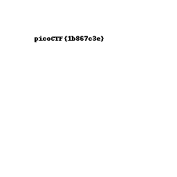

# Pixelated

[題目連結](https://play.picoctf.org/practice/challenge/100)

偷看一下提示，發現把兩張圖片加起來就可以得到flag

```python
import cv2

img1 = cv2.imread("scrambled1.png")
img2 = cv2.imread("scrambled2.png")

cv2.imwrite("Pixelated.webp", img1 + img2)
```



(版權為原作者所有)
