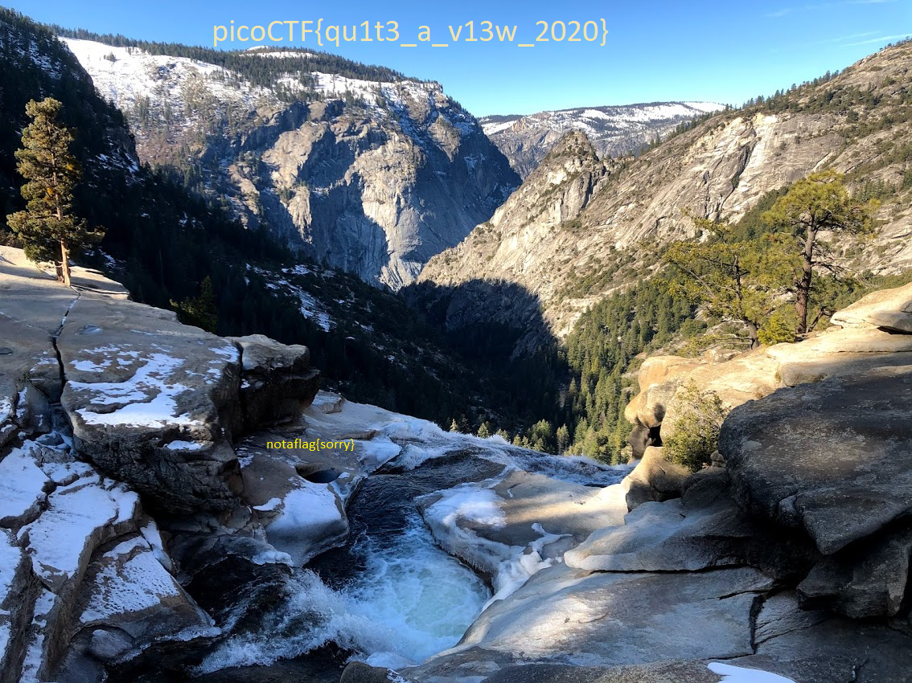

# tunn3l v1s10n

[題目連結](https://play.picoctf.org/practice/challenge/112)

首先下載檔案

```bash
wget -q https://mercury.picoctf.net/static/da18eed3d15fd04f7b076bdcecf15b27/tunn3l_v1s10n
```

用`file`來看看檔案類型，發現啥都看不出來

```console
$ file tunn3l_v1s10n
tunn3l_v1s10n: data
```

用`hxd`來看看檔案開頭，發現有`BM`，上網找了一下應該是一個`bmp`檔

```console
$ hxd -l 16 tunn3l_v1s10n
00000000: 424d 8e26 2c00 0000 0000 bad0 0000 bad0  BM.&,...........
```

在維基百科上可以查到BMP的檔案格式，offset 0x02處是檔案大小，offset 0x0a處是pixel data的開始位置。  
所以根據上面的結果，檔案大小是`0x002c268e`(要用little endian看)，和真正的檔案大小一樣。  
pixel data的開始位置是`0x0000d0ba`，不過它看起來有點bad，先放著。  

再來看DIB header，開頭的前4個byte是header size，不過也被改成`0x0000d0ba`，所以肯定有問題，
基本上這應該是`0x00000028`(40)。  
接下來是width和height各佔4個byte，分別是`0x0000046e`(1134)和`0x00000132`(306)。  
再來有兩個short，分別是`0x0001`和`0x0018`(24)，分別是planes和bit per pixel，應該是正常的。  
compression method佔4個byte，這裡是`0x00000000`，代表沒有壓縮。  
image size佔4個byte，這裡是`0x002c2658`，所以DIB header確實是40 bytes。  
長寬的pixel per meter各佔4個byte，這裡各是`0x00001625`。  
color table和important color table各佔4個byte，這裡各是`0x00000000`，代表沒有。  

接下來就是pixel array了，所以pixel data的開始位置應該是`0x00000036`。  
隨便開個hex editor，把算出來的值填進去，就可以正常開啟了。不過這樣還是沒找到flag，只有一個`notaflag{sorry}`。  
稍微算個數學，`0x2c2658 / 0x46e / 3 = 0x352`，所以高度或寬度有一個不對。  
先猜高度，沒想到就中了，flag就顯示在這張圖裡了。  

  
(版權為原作者所有)

最後得到flag是`picoCTF{qu1t3_a_v13w_2020}`
